# Bienvenidos a la practica 9
En esta práctica vamos a realizar diferentes cosas:
- Estamos utilizando una extensión de VS
- Esta extensión está basada en Markdown
- Vamos a realizar tres actividades:
    - Diapositiva con MARP
    - Mapa Mental con MARKMAP
    - Diagramas UML
    
---
# Iniciando en VS
Para poder realizar estas actividades primero vamos a tener que instalar tres extensiones en VS, las cuales son:
    - Marp
    - Markmap
    - PlantUML Previewer
Después de intalarlas vamos a crear una carpeta nueva, en donde vamos a crear mas sub carpetas donde vamos a realzar cada una de las actividades, primero vamos a iniciar con la diapositiva en MARP.

---
Ejemplo de visualización de la carpeta:
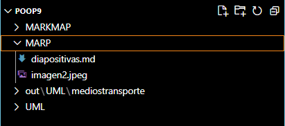
Aquí se pued ver las carpetas creadas, así como tambien dentro de marp se crea un archivo con extensión .md

---
# Diapositiva con MARP
Para poder realizar una diapositiva con Marp se necesita inicar con la siguiente sintaxis:
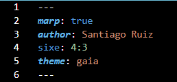
En esta se define el autor, el tamaño de la hoja y el tema predeterminado que se usara.
Como también se puede apreciar cada tres guiones significan que empieza una nueva hoja.

---
## Personalización de la Letra
Después de tener las especificaciones anteriormente mostradas completas puedes crear tu diapositiva libremente, sin embargo estas se pueden personalizar aún más con los siguientes aditamentos:
- Se pude cambiar la letra del texto de estas 4 maneras:
    - **Negrita**--------`**Negrita**`
    - *Italica*----------`*Italica*`
    - ~~Tachado~~--------`~~Tachado~~`
    - `codigo`---------`´codigo´` (Este ultimo va con acentos invertidos)

---
## Personalización del Título
Aquí se muestra como los diferentes titulos pueden ser utilizados, así como su escritura en el código:
# Título 1--------`# Título 1`
## Título 2--------`## Título 2`
### Título 3--------`### Título 3`
#### Título 4--------`#### Título 4`

---
## Agregando imagenes
Para agregar imagenes solo de debe descargar una imagen en la carpeta de tu dispositivo, después esta la mueves dentro de la carpeta del programa, en nuestro caso la carpeta MARP, por ultimo se agrega la siguiente línea la código:

``

Donde se elige su anchura en pixeles, así como se le agrega el nombre de la imagen descargada junto con su extensión (.png).

---
Por ejemplo:

###### Diagrama de una red neuronal
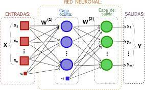
En este caso la línea de codigo quedo de la sig manera:

``

---
## Tablas
Para agregar tablas solo se debe agregar la siguiente sintaxis:
`|Titulo 1|Titulo 2|`
`|---|---|`
`|celda 1|celda 2|`
`|celda 3 |celda 4|`
Al final se mostrara de la sig manera en pantalla:
|Titulo 1|Titulo 2|
|---|---|
|celda 1|celda 2|
|celda 3 |celda 4|

---
## Comentarios
Para finalizar el tutorial de las diapositivas se encuentran también los comentarios, estos solo se ven en el código y sirven para hacer alguna notación extra.
Hay dos maneras: 

`[comment]: <> (This is a comment, it will note be included)`

`<!--Este es un comentario-->`

---
# Mapa Mental con MARKMAP
Para continuar con las actividades, ahora realizaremos un mapa mental con la extensión MARKMAP, en la carpeta anteriormente creada de MARKMAP, vamos a crear un nuevo documento, con el nombre mapamental.md.

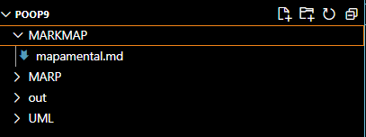

---
Posteriormente dentro del documento crearemos el mapa deseado, su estructura es muy sencilla, ya que solo utilizaremos el simbolo de **#** para definir de que manera lo vamos a organizar.

Por ejemplo: 
`# Mapa mental`
`## Rama 1`
`### Subrama 1.1`
`### Subrama 1.2`
`#### Subrama 1.2.1`
`## Rama 2`
`### Subrama 2.1`
`### Subrama 2.2`

---
De esta manera, al presionar el boton con forma de tridente de la parte superior derecha de VS, generará el mapa:

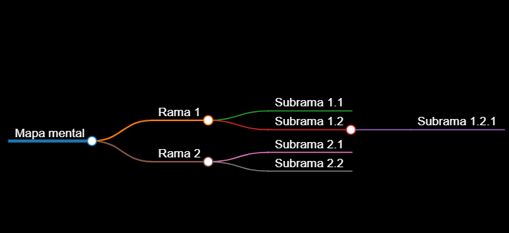 

---
## Exportación
Este mapa se puede exportar para que sea visible en una página *.html*, para hacerlo es de igual manera muy sencillo, en la página donde generamos el mapa hace un momento, en la parte inferior derecha se encuentra unos botones.

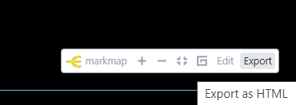

---
Al darle en el boton *Export* te dara la opcion de guardar en tu dispositivo la página *.html*, esta se genera automaticamente y queda de la sig manera: 

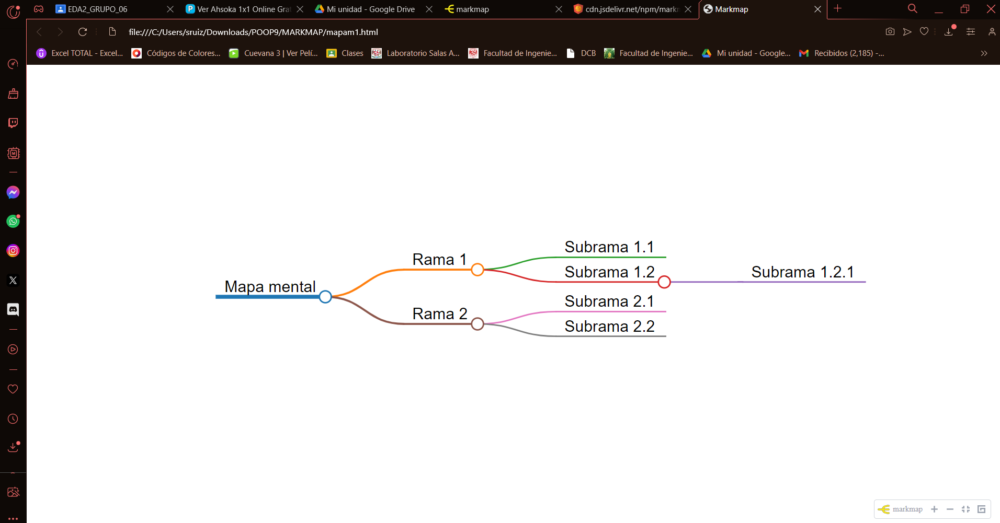

---
Así como también el código de esta página *.html* se queda en la carpeta MARKMAP.

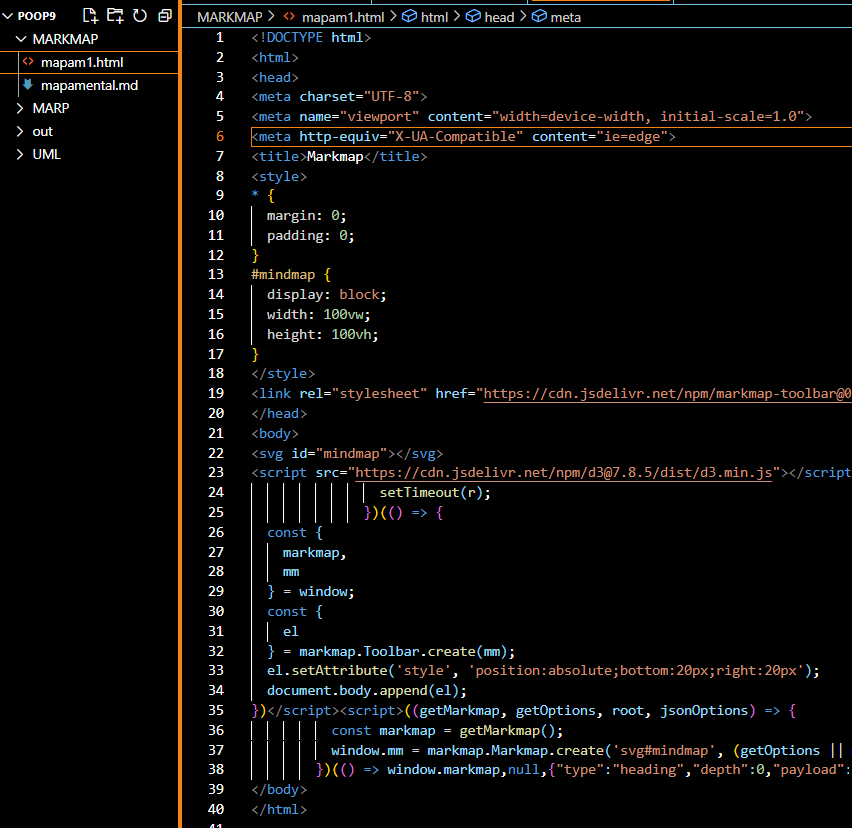

---
# Diagramas UML
 La ultima actividad consiste en realizar diagramas en la extensión UML, para este caso en especifico vamos a utilizar como ejemplo clases que hemos creado anteriormente en practicas pasadas, para empezar vamos a ir a la ultima carpeta que creamos,  UML, dentro de esta misma se crea un nuevo documento el cual llamaremos *mediostransporte.md*, donde empezaremos con el sig código:

`---`
`marp: false`
`---`

---
Para iniciar a poner los diagrmas se debe agregar al inicio:

`@startuml`

Posteriormente se agrega su escala y la información de cada clase, es decir sus atributos y sus metodos, para al final agregar la relacion de cada uno de ellos, quien es 'padre' y quien es 'hijo', así como si estas llegan a ser una interfaz.
Por ejemplo: 
`@startuml`
`scale 3`

`abstract class MediosTransporte{}`

---
`class TransporteAcuatico{`
`.   -velocidad: int`
`.   -capacidad: String`
`.   +aumentarVelocidad():void`
`}`
`class Barco{`
`.   -puertoOrigen: String`
`.   -puertoDestino: String`
`.   +abordarPasajeros():void`
`}`
`MediosTransporte <|--TransporteAcuatico`
`TransporteAcuatico<|--Barco : interfaz`
`@enduml`

---
Con esto ya hecho se puede realizar el diagama llendo a la pestaña *View*, en esta se selecciona *Command Palette*.

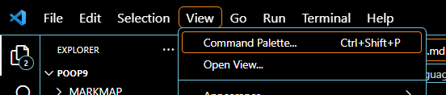

De ahí vas a buscar plantUML y seleccionas la primera opción.

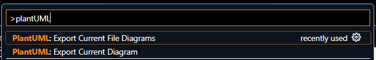

---
Lo guardas en tu dispositivo y se generará la imagen corresponidente a tu código:
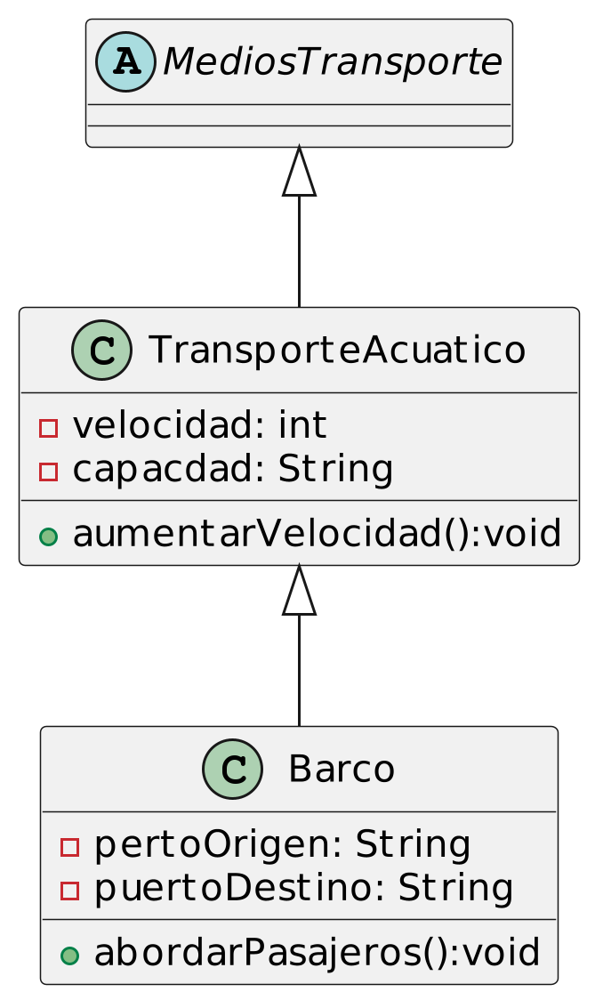 

---
En la imagen se puede apreciar como es que cada clase tiene sus respectivos atributos y metodos, así como que clase es 'padre' y cual es 'hijo'.

Está imagen se puede guardar facilmente en su dispositivo, para poder usarla en algun documento.

Con esto finaliza el tutorial de como utilizar MARKDOWN, MARP y UML, en base a estos conocimientos basicos se puede crear algo mucho más elaborado para un trabajo o tarea asignado.